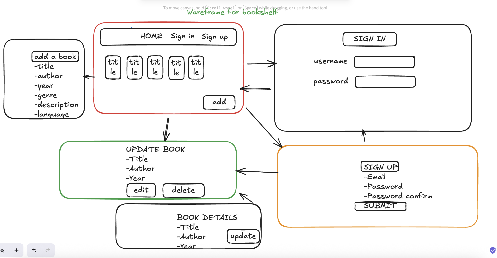

## 📚 Bookshelf – Simple Django App

* Bookshelf is a beginner-friendly Django web application designed to help new developers understand the fundamentals of web development using Django.
The project allows users to add, view, and manage books in a digital bookshelf.

* It is intentionally kept simple so that beginners can comfortably learn core Django concepts such as:

* Creating and managing Django models

* Building views and handling HTTP requests

* Working with templates

* Using forms to capture user input

* Setting up URL routing

* Understanding project structure and best practices

* This project is perfect for students, beginners, or anyone looking for a clean and minimal Django example that still demonstrates real-world patterns.

# 🚀 Features
* 📕 Add New Books

* Users can fill out a simple form to add new books to the bookshelf, including title, author, description, and publication year.

* 📚 Book List View

* Displays all added books in a clean and readable list. Each entry includes a link to view more details.

* 🔍 Book Details

* Shows extended information about a specific book in a simple detail page.

# ✏️ Clean UI & Logical Navigation

* The interface is intentionally minimal to focus on backend concepts while still providing smooth navigation for end users.

# 🛠️ Tech Stack

# Component	Description

1. Python 3	Core programming language
2. Django 4+	Web framework used to build the project
3. SQLite	Default lightweight database included with Django
4. HTML/CSS	For basic presentation of templates

* This stack makes the project fully self-contained, easy to run anywhere, and ideal for learning.

# ▶️ Getting Started

1. Clone the repo:
   git clone https://github.com/username/bookshelf-api.git

2. Install dependencies:
   pip install -r requirements.txt

3. Apply migrations:
   python manage.py migrate

4. Run the development server:
   python manage.py runserver

* Then open http://127.0.0.1:8000/ in the browser.

# 📁 Project Structure
bookshelf/               # Main project folder
├── bookshelf/           # Project configuration (settings, URLs, WSGI)
│   ├── settings.py
│   ├── urls.py
│   └── app.py
│
├── books/               # Main application logic
│   ├── models.py        # Database models (Book model)
│   ├── views.py         # View functions for list
│   ├── serializer.py    # Django ModelForm for adding 
│   ├── urls.py          # App-level URL routing
│   
│
└── manage.py            # Django project runner

# 🎯 Learning Objectives

# By working through this project, we will learn how to:

✔ Set up and configure a Django project
✔ Build database models and perform migrations
✔ Create dynamic views and render templates
✔ Work with Django forms for user input
✔ Use URL routes to connect views and pages
✔ Understand the structure of a typical Django application

These skills form the foundation for more advanced Django development.

# 🙌 Contributions

* Contributions are welcome!
* Whether we want to improve the UI, add features or expand documentation, we can submit a pull request.

# 📄 License
MIT License.

## 📚 Simple wareframe for Bookshelf
+--------------------------------------+
|              BOOK LIST               |
+--------------------------------------+
|  [Add Book]                          |
|                                      |
|  • The Hobbit — Tolkien              |
|  • Dune — Frank Herbert              |
|  • 1984 — George Orwell              |
|                                      |
+--------------------------------------+

+--------------------------------------+
|            BOOK DETAILS              |
+--------------------------------------+
|  Title: The Hobbit                   |
|  Author: J.R.R. Tolkien              |
|  Year: 1937                          |
|                                      |
|  [Back]                              |
+--------------------------------------+

+--------------------------------------+
|             ADD BOOK                 |
+--------------------------------------+
|  Title:  [______________]            |
|  Author: [______________]            |
|  Desc:   [______________]            |
|  Year:   [____]                     |
|                                      |
|  [ Save ]                            |
+--------------------------------------+

# Wareframe

# bookshelf-api
